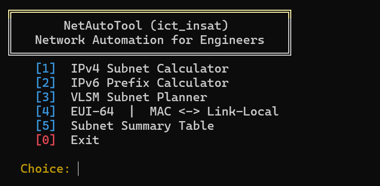
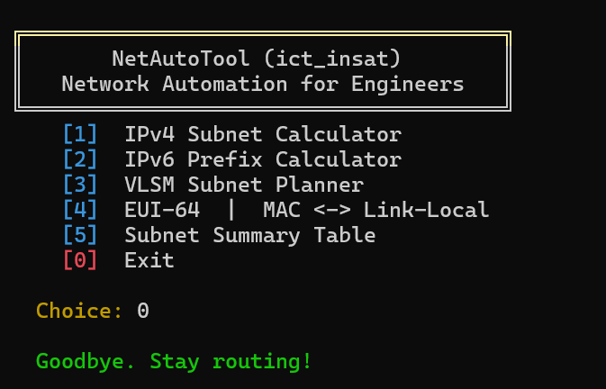
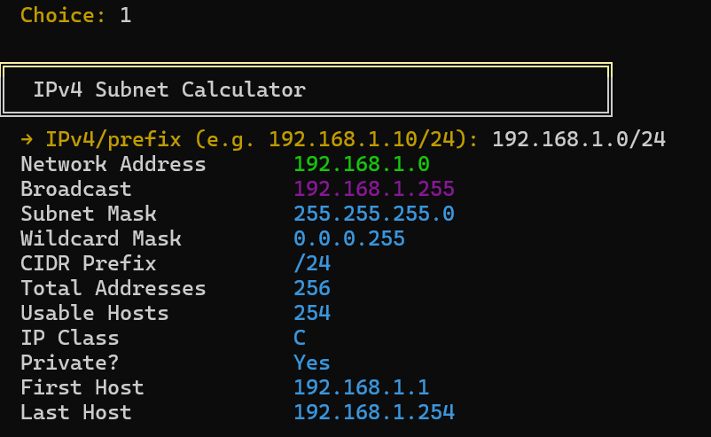
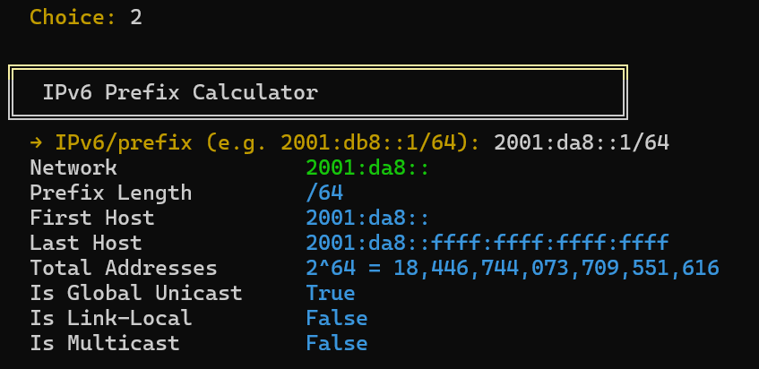
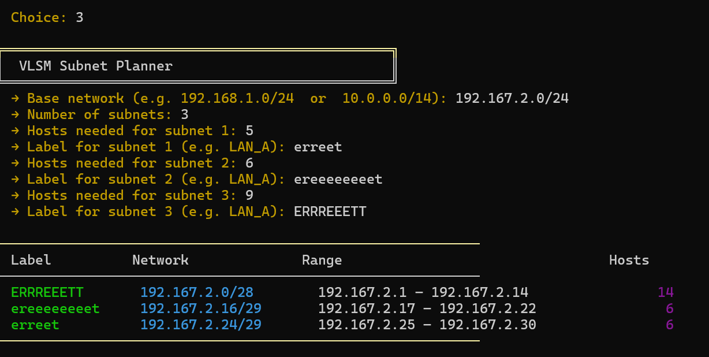
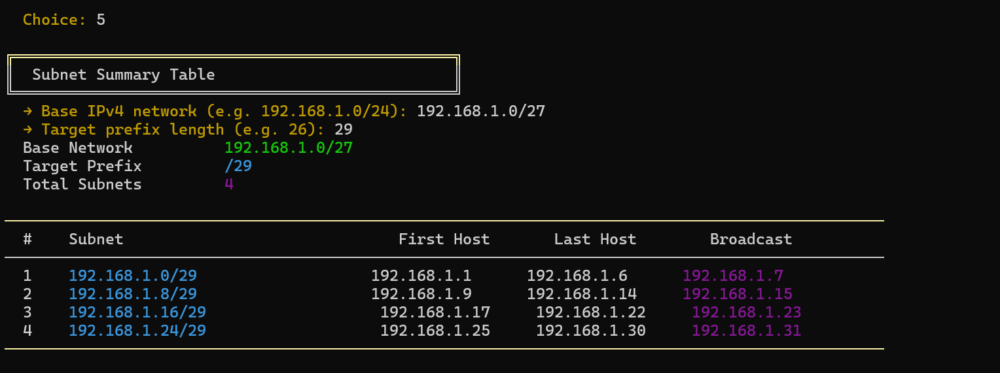

# ICT Tool

> **A modern, menu-driven CLI toolkit for subnetting, VLSM, and IPv6 — perfect for CCNA/DevNet practice and real-world network planning.**

---

## ✨ Features

- **IPv4 Subnet Calculator** — Network, broadcast, mask, wildcard, usable range, class, private/public detection
- **IPv6 Prefix Calculator** — Prefix boundaries, address count, type flags
- **VLSM Subnet Planner** — Largest-first allocation for efficient address use
- **EUI-64 Tool** — MAC ↔ IPv6 link-local conversion with step-by-step explanation
- **Subnet Summary Table** — List all child subnets from a base prefix
- **ERREETOOL Advanced Toolkit** — Typer-based subcommands for scanning, ports, DNS, ping, traceroute, Wi-Fi, speed test, and diagnostics

---

## 🧰 ERREETOOL (Advanced Toolkit)

ERREETOOL is a professional, command-style toolkit built for advanced networking operations.

**Launch from the main menu:**
1. Select **[6] ERREETOOL | Advanced Networking Toolkit**
2. Enter a one-off command (e.g., `scan 192.168.1.0/24`)

**Direct CLI usage:**
```sh
python -m erreetool.cli scan 192.168.1.0/24
python -m erreetool.cli ports 192.168.1.1 --full
python -m erreetool.cli dns openai.com
python -m erreetool.cli ping google.com
python -m erreetool.cli trace google.com
python -m erreetool.cli wifi
python -m erreetool.cli speedtest
python -m erreetool.cli doctor
```

---

## 📸 Example Output

Below are real screenshots of the tool in action:

**Main Menu**

<p align="center">
	
</p>

**Main Menu (Exit)**

<p align="center">
	
</p>

**IPv4 Subnet Calculator**

<p align="center">
	
</p>

**IPv6 Prefix Calculator**

<p align="center">
	
</p>

**VLSM Subnet Planner**

<p align="center">
	
</p>

**Subnet Summary Table**

<p align="center">
	
</p>

---

## 🚀 Quick Start

### Requirements

- Python 3.10+

### Getting Started

1. **Clone this repository:**
   ```sh
   git clone https://github.com/anascherif/ict_tool.git
   cd ict_tool
   ```
2. **Set up your environment and run the tool:**
   - Open a terminal in the project folder and run **one** of the following commands:

   **PowerShell:**

   ```powershell
   python -m venv .venv; .venv\Scripts\Activate.ps1; pip install -r requirements.txt; python ict_tool.py
   ```

   **CMD:**

   ```cmd
   python -m venv .venv && .venv\Scripts\activate.bat && pip install -r requirements.txt && python ict_tool.py
   ```

   This will automatically create a virtual environment, install dependencies, and launch the tool.

3. **Re-run the tool anytime:**
   - After setup, you can launch the tool again with:

   **PowerShell or CMD:**

   ```sh
   .venv\Scripts\python.exe ict_tool.py
   ```

---

## 🤝 Contributing

Pull requests are welcome! For major changes, please open an issue first to discuss what you would like to change.

---

## 📄 License

This project is licensed under the MIT License. See the [LICENSE](LICENSE) file for details.

---

## 🙋 Contact

For questions or feedback, open an issue or contact [anas abd elmalek cherif](https://github.com/anascherif).
